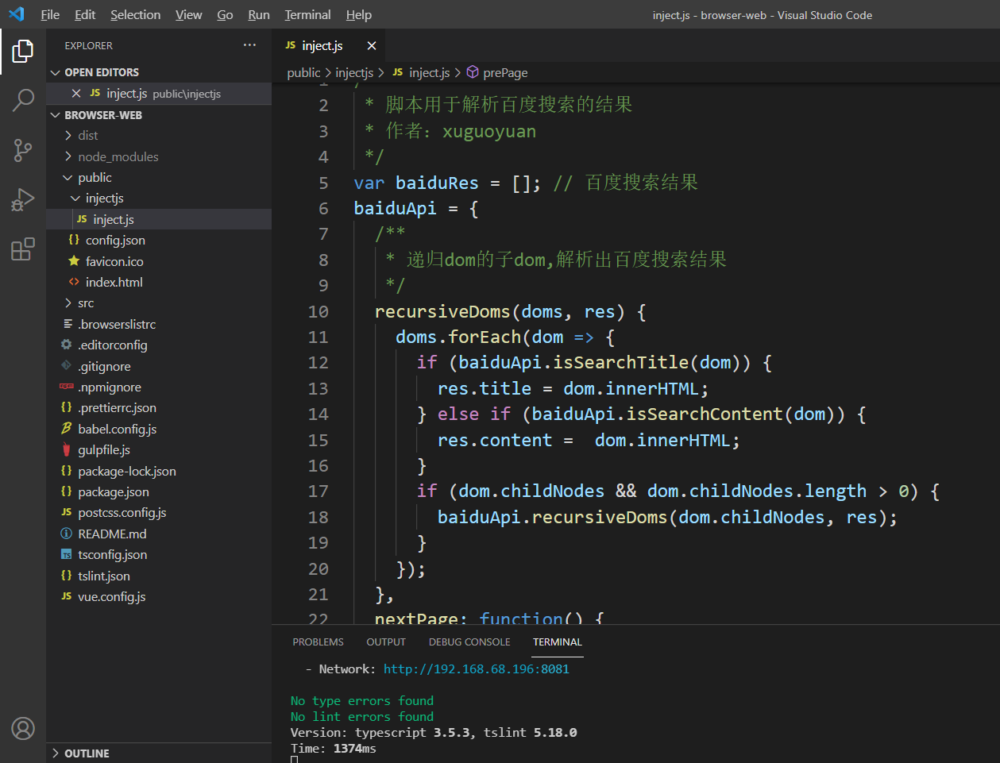
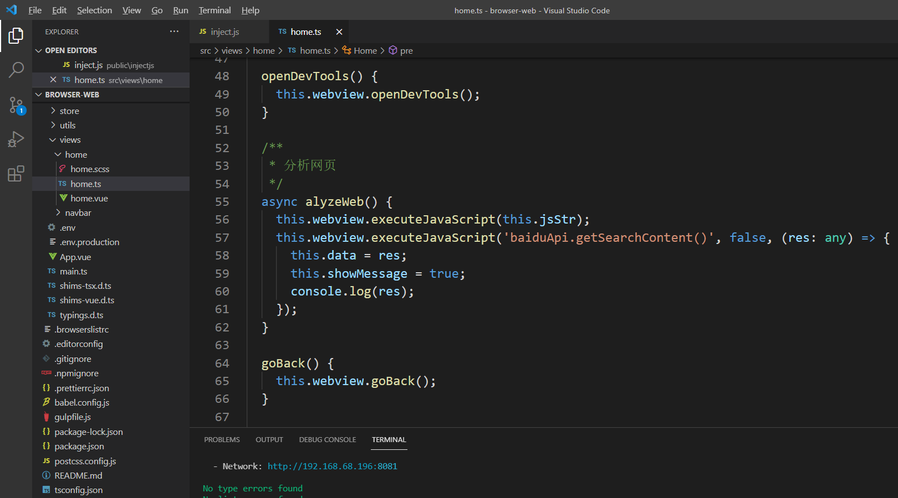

## 基于Electron封装浏览器

## 功能预览


## 打包

本工具分为web端和壳程序，browser-web是web端，browser-shell是壳程序

+ 1、打包web端，在browser-web中执行指令，生成dist包

  ```
  npm run build
  ```

+ 2、将生成的dist包拷贝到browser-shell的public目录下

+ 3、打包壳程序，在browser-web中执行指令，生成安装包和绿色安装包

  ```
  npm run build
  ```

  

## 在browser-shell配置调试

1、配置调试参数

```
{
    // Use IntelliSense to learn about possible attributes.
    // Hover to view descriptions of existing attributes.
    // For more information, visit: https://go.microsoft.com/fwlink/?linkid=830387
    "version": "0.2.0",
    "configurations": [
        {
            "type": "node",
            "request": "launch",
            "name": "Launch Electron",
            // "preLaunchTask": "start",
            "runtimeExecutable": "${workspaceFolder}/node_modules/.bin/electron",
            "outFiles": ["${workspaceFolder}/build/resources/main/**/*.js"],
            "args": ["${workspaceFolder}/build/resources"],
            "sourceMaps": true,
            "outputCapture": "std"
          }
    ]
}
```

2、点击调试按钮运行调试即可


## 脚本注入，解析网页

1、编写脚本inject.js：



2、在vue页面中注入脚本并使用，得到返回结果

